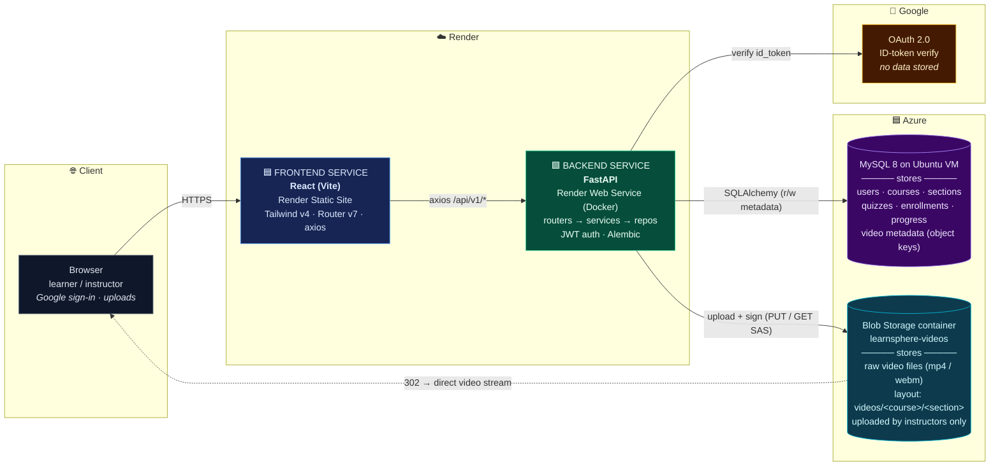

# LearnSphere

A localhost-only Learning Management System. LearnSphere provides a
clean, production-shaped architecture for hosting authentication, courses,
enrollments, and learner progress features.

> Out of scope for the initial scaffold: login, signup, JWT, authentication, user
> management, and any course/business logic.

## Stack

| Layer    | Technology                                                  |
| -------- | ----------------------------------------------------------- |
| Backend  | Python 3.13, FastAPI, SQLAlchemy 2.0, Alembic, Pydantic v2  |
| Database | MySQL 8                                                     |
| Frontend | React 19, Vite 6, React Router v7, Axios, Tailwind CSS v4   |
| Infra    | Docker, Docker Compose                                      |

## Repository layout

```
.
├── backend/        # FastAPI service (see backend/README.md)
├── frontend/       # React app  (see frontend/README.md)
├── docker-compose.yml
├── .gitignore
└── README.md
```

## Architecture

<p align="center">
  
</p>

The animated SVG above shows live request flow through the system. Static
fallback (rendered by GitHub from Mermaid):



**Who uploads what:**

| Direction | What's transferred | Where it ends up |
| --- | --- | --- |
| Browser → Backend (instructor) | course metadata, section/quiz edits | **MySQL** (`courses`, `sections`, `quizzes`, `quiz_questions`) |
| Browser → Backend → Azure Blob (instructor) | raw video file (multipart/form-data) | **Azure Blob** under `videos/<course>/<section>/<file>` |
| Backend → MySQL | video object key + filename + content-type | **MySQL** `section_videos` row |
| Browser → Backend (learner) | progress events, quiz answers | **MySQL** (`enrollments`, `progress`) |
| Google → Backend | verified user identity (sub, email) | **MySQL** `users` (upserted on first login) |

**Request lifecycle:**

1. **Auth** — browser POSTs Google ID token to `/api/v1/auth/google`; backend
   verifies it with Google, upserts the user, returns a session JWT.
2. **API calls** — every subsequent request from React carries
   `Authorization: Bearer <jwt>`; routers delegate to services, services to
   repositories, repositories to SQLAlchemy.
3. **Video upload** — instructor `POST`s the file to
   `/api/v1/instructor/sections/{id}/video`; backend streams it straight into
   Azure Blob and saves the object key in MySQL.
4. **Video playback** — learner hits `GET /api/v1/videos/{key}`; backend
   issues a short-lived SAS URL and returns a `302` redirect, so the bytes
   never transit the backend — the browser streams them straight from Azure.

**Layering rule:** routers → services → repositories → ORM models. Routers
must not touch SQLAlchemy directly.

## Quick start (Docker)

Requires Docker Desktop.

```bash
docker compose up --build
```

- API:        <http://localhost:8000>
- API docs:   <http://localhost:8000/docs>
- Health:     <http://localhost:8000/api/v1/health>
- Frontend:   <http://localhost:5173>
- MySQL:      `localhost:3306` (user `lms_user`, password `lms_password`, db `lms_db`)

Stop:

```bash
docker compose down
```

Wipe the database volume:

```bash
docker compose down -v
```

## Quick start (local, without Docker)

Use this when you want to run the backend and frontend directly on your
machine (faster reloads, easier debugging in VS Code / PyCharm). You still
need a MySQL instance — the easiest is to run just the MySQL container from
docker-compose and skip the rest.

### Prerequisites

| Tool | Version | Notes |
| ---- | ------- | ----- |
| Python | 3.13.x | `python --version` |
| Node.js | 20 LTS or newer | `node --version` |
| MySQL | 8.x | Native install **or** `docker compose up mysql -d` |
| Git | any | to clone the repo |

### 1. Get the code

```bash
git clone <your-fork-url> learnsphere
cd learnsphere
```

### 2. Start MySQL

**Option A — use the docker-compose MySQL only** (recommended, zero install):

```bash
docker compose up mysql -d
```

This starts MySQL on `localhost:3306` with the database `lms_db`, user
`lms_user`, password `lms_password` already created — nothing else to do.

**Option B — use a native MySQL install:**

```sql
CREATE DATABASE lms_db CHARACTER SET utf8mb4 COLLATE utf8mb4_unicode_ci;
CREATE USER 'lms_user'@'localhost' IDENTIFIED BY 'lms_password';
GRANT ALL PRIVILEGES ON lms_db.* TO 'lms_user'@'localhost';
FLUSH PRIVILEGES;
```

### 3. Backend

```bash
cd backend

# Create + activate a virtualenv
python -m venv .venv
.venv\Scripts\activate                # Windows (PowerShell: .venv\Scripts\Activate.ps1)
# source .venv/bin/activate           # macOS / Linux

# Install Python deps
pip install --upgrade pip
pip install -r requirements.txt

# Configure env
copy .env.example .env                # Windows
# cp .env.example .env                # macOS / Linux
```

Open `backend/.env` and set at minimum:

```ini
APP_ENV=development
DEBUG=true

# Database — matches the docker-compose MySQL defaults
DB_HOST=localhost
DB_PORT=3306
DB_USER=lms_user
DB_PASSWORD=lms_password
DB_NAME=lms_db

# JWT — any long random string for local dev
JWT_SECRET=change-me-to-anything-long-and-random

# Google OAuth — your OAuth web client ID (required to sign in)
GOOGLE_CLIENT_ID=xxxxxxxxxxxx.apps.googleusercontent.com

# Admin auto-promotion (comma-separated emails)
ADMIN_EMAILS=you@example.com

# CORS — allow the Vite dev server
CORS_ORIGINS=http://localhost:5173

# Storage — local disk is the default for dev
STORAGE_BACKEND=local
```

> **Leave `DATABASE_URL` empty** in local dev. When it's empty the app builds
> the URL from `DB_HOST/DB_USER/...` above. Only set `DATABASE_URL` when you
> want to point at PlanetScale or a remote MySQL.

Run migrations and start Uvicorn:

```bash
alembic upgrade head
uvicorn app.main:app --reload --host 127.0.0.1 --port 8000
```

You should see:

```
INFO:     Application startup complete.
INFO:     Uvicorn running on http://127.0.0.1:8000 (Press CTRL+C to quit)
```

Sanity check in another shell:

```bash
curl http://localhost:8000/api/v1/health/live
# → {"status":"alive"}
```

> **Optional — seed sample courses:** set `AUTO_SEED_ON_STARTUP=true` in
> `.env` and restart Uvicorn once. The seed runs from `backend/content/`
> and you'll see a few demo courses on the homepage. Turn it back to
> `false` after the first run.

### 4. Frontend

In a **new terminal** (leave Uvicorn running):

```bash
cd frontend

# Install deps
npm install

# Configure env
copy .env.example .env                # Windows
# cp .env.example .env                # macOS / Linux
```

Open `frontend/.env` and set:

```ini
VITE_API_BASE_URL=http://localhost:8000/api/v1
VITE_GOOGLE_CLIENT_ID=xxxxxxxxxxxx.apps.googleusercontent.com    # same as backend
```

Start the dev server:

```bash
npm run dev
```

Open the URL Vite prints (default <http://localhost:5173>).

### 5. Verify end-to-end

1. Open <http://localhost:5173>.
2. Click **Sign in with Google**, pick the account whose email is in
   `ADMIN_EMAILS`. You should land on the home page as admin.
3. Click **Health** in the nav → expect `status: ok`, `database: ok`.
4. Browse to a course → play a video. Videos served from local disk
   (`backend/content/...`) stream directly through `/api/v1/videos/.../stream`.

### Daily workflow

| Action | Command |
| ------ | ------- |
| Start MySQL | `docker compose up mysql -d` |
| Start backend | (in `backend/`) `.venv\Scripts\activate && uvicorn app.main:app --reload` |
| Start frontend | (in `frontend/`) `npm run dev` |
| Stop MySQL | `docker compose stop mysql` |
| Wipe MySQL data | `docker compose down -v` (warning: deletes all DB rows) |
| Create a new migration | `alembic revision --autogenerate -m "..."` then `alembic upgrade head` |
| Run backend tests | `pytest` (from `backend/`) |
| Run frontend lint | `npm run lint` (from `frontend/`) |

### Troubleshooting

- **`ModuleNotFoundError: app`** — activate the venv first, then run uvicorn
  from inside the `backend/` directory.
- **`Can't connect to MySQL server on 'localhost'`** — MySQL container/service
  isn't running. `docker compose up mysql -d` or start your native service.
- **`Access denied for user 'lms_user'`** — credentials in `.env` don't match
  your MySQL. The docker-compose defaults are `lms_user / lms_password / lms_db`.
- **Google sign-in fails with "origin mismatch"** — add
  `http://localhost:5173` to your OAuth client's *Authorized JavaScript
  origins* in Google Cloud Console.
- **CORS error in the browser** — `CORS_ORIGINS` in `backend/.env` must
  include the exact frontend origin (`http://localhost:5173`), then restart
  Uvicorn.
- **Videos won't play / 404** — `STORAGE_BACKEND` must be `local` for local
  dev, and the file must exist under `backend/content/.../<slug>/videos/`.

## Deploying to Render

The repo ships a `render.yaml` blueprint that creates two services from this
single repo: a Dockerised backend Web Service and a static React frontend.
Render has no managed MySQL, so the database lives on an **Azure VM** and
uploaded video files live in **Azure Blob Storage** (the free tier's
ephemeral disk would otherwise lose every upload on restart).

Local dev is unchanged — `docker compose up -d` still runs MySQL + backend +
frontend the way it always has. The new env vars all default to "local mode".

### 1. Prepare external services

#### MySQL on Azure VM
1. Spin up an Ubuntu VM (B1s is plenty for dev), open inbound TCP 3306 in the
   NSG to Render's outbound IPs (https://render.com/docs/static-outbound-ip-addresses).
2. `sudo apt install mysql-server`, then in `/etc/mysql/mysql.conf.d/mysqld.cnf`
   set `bind-address = 0.0.0.0` and `sudo systemctl restart mysql`.
3. Create the database and user:
   ```sql
   CREATE DATABASE lms_db;
   CREATE USER 'lms_user'@'%' IDENTIFIED BY '<long-random-password>';
   GRANT ALL PRIVILEGES ON lms_db.* TO 'lms_user'@'%';
   FLUSH PRIVILEGES;
   ```
4. The `DATABASE_URL` you'll paste into Render is
   `mysql://lms_user:<password>@<vm-public-ip>:3306/lms_db`.

#### Azure Blob Storage (object storage)
1. Create a Storage Account (Standard LRS) in the same region as the VM.
2. Inside it, create a private container (e.g. `learnsphere-videos`).
3. Storage account → **Access keys** → copy the account name and `key1`.
4. Storage account → **Resource sharing (CORS)** → Blob service → add a rule:
   - Allowed origins: `https://learnsphere-frontend.onrender.com`
   - Allowed methods: `GET`, `HEAD`
   - Allowed / exposed headers: `*`
   - Max age: `3600`
5. *(Optional)* Put Azure Front Door / a custom domain in front of the
   container — set it as `AZURE_PUBLIC_BASE_URL` to skip SAS URLs.

#### Google OAuth
In your existing OAuth client, add the deployed frontend origin (e.g.
`https://learnsphere-frontend.onrender.com`) to *Authorized JavaScript
origins*.

### 2. Apply the blueprint

In Render: **New → Blueprint** → point at this repo. Render reads
`render.yaml` and creates `learnsphere-backend` and `learnsphere-frontend`
but does not start them until secrets are set.

### 3. Set secrets in the dashboard

Backend (`learnsphere-backend` → Environment):

| Key | Value |
| --- | --- |
| `DATABASE_URL` | `mysql://lms_user:<password>@<vm-public-ip>:3306/lms_db` |
| `GOOGLE_CLIENT_ID` | OAuth web client ID |
| `ADMIN_EMAILS` | comma-separated emails to auto-promote |
| `CORS_ORIGINS` | `https://learnsphere-frontend.onrender.com` |
| `AZURE_STORAGE_ACCOUNT_NAME` | storage account name |
| `AZURE_STORAGE_ACCOUNT_KEY` | `key1` value |
| `AZURE_STORAGE_CONTAINER` | container name, e.g. `learnsphere-videos` |
| `AZURE_PUBLIC_BASE_URL` | *(optional)* CDN / custom domain |

`JWT_SECRET` is auto-generated. `STORAGE_BACKEND=azure` is already wired.
Set `DB_SSL=true` if your VM's MySQL is configured for TLS.

Frontend (`learnsphere-frontend` → Environment):

| Key | Value |
| --- | --- |
| `VITE_API_BASE_URL` | `https://learnsphere-backend.onrender.com/api/v1` |
| `VITE_GOOGLE_CLIENT_ID` | same value as backend `GOOGLE_CLIENT_ID` |

### 4. Deploy

Trigger **Manual Deploy** on both services. The backend container runs
`alembic upgrade head` automatically before starting Uvicorn. Watch the logs
for `Uvicorn running on http://0.0.0.0:10000`. Visit the frontend URL and
sign in.

> **Tip — first sign-in as admin:** the admin role is granted on every
> successful sign-in if the user's email matches `ADMIN_EMAILS`. So you can
> add yourself to `ADMIN_EMAILS` before deploying, sign in once, and you're
> an admin instantly.

## Phase 2 readiness

The scaffold is shaped so that adding auth later requires **no structural
changes**:

- `app/api/deps.py` is the single place to introduce a `current_user`
  dependency — every router already depends on it through the established
  `Depends(...)` pattern.
- `app/core/exceptions.py` already includes `AppException` subclasses
  (`NotFoundError`, `ConflictError`, `ValidationError`) that auth flows can
  raise without touching FastAPI internals.
- `app/repositories/base.py` provides a typed CRUD base; a `UserRepository`
  drops in next to it.
- The frontend `apiClient.js` interceptor and `AppContext` are pre-wired
  injection points for token handling and `currentUser` state.
